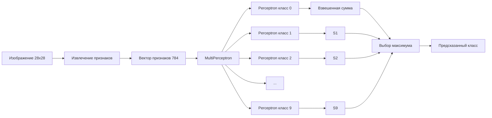

# Perceptron Image Classifier in Java


Проект реализует классификатор изображений на основе алгоритма Perceptron,
который используется для распознавания различных категорий изображений
(цифры, предметы, символы, звуки и т.д.).

Алгоритм обучается на изображениях и пытается определить класс изображения (цифра, животное, объект и т.д.).

Проект основан на задании **Princeton COS126 – Image Classification**.

Проект демонстрирует:

- объектно-ориентированное программирование
- реализацию ML-алгоритма
- извлечение признаков из изображений
- многоклассовую классификацию

---

# 📷 Пример изображений

Пример входных данных из датасета **MNIST**:

| Digit | Image |
|------|------|
| 0 |  |
| 5 |  |
| 3 |  |

Каждое изображение преобразуется в **вектор признаков размером 784 (28×28)**.

**Примечание:** в GitHub-репозиторий распакованная папка `datasets/digits/digits/` не включена, поэтому эти изображения могут не отображаться прямо на странице репозитория. Локально они используются для маленьких тестовых запусков, если папка `digits/` подготовлена отдельно.

---

# 🧠 Алгоритм

Используется **Multiclass Perceptron (One-vs-All)**.

Идея:

1. Для каждого класса создаётся отдельный perceptron
2. Каждый perceptron обучается распознавать **свой класс**
3. При классификации выбирается perceptron с максимальной оценкой

При обучении используется правило обновления весов:

```text
если prediction ≠ label:
    weights[label] += x
    weights[predicted] -= x
````

При предсказании выбирается perceptron с **максимальной взвешенной суммой**.

---

# 🧠 Архитектура алгоритма



### Что показывает схема

1. изображение **28×28**
2. преобразуется в **784-мерный вектор признаков**
3. каждый perceptron обучается распознавать **один класс**
4. выбирается perceptron с **максимальной weighted sum**

Это стратегия **One-vs-All**.

---

# 📊 Результаты

| Dataset   | Training Size | Test Size | Error Rate |
| --------- | ------------: | --------: | ---------: |
| digits    |        60 000 |    10 000 | **0.1293** |
| fashion   |        60 000 |    10 000 |     0.2204 |
| Kuzushiji |        60 000 |    10 000 |     0.4587 |
| animals   |        60 000 |    12 000 |     0.7328 |
| music     |        50 000 |    10 000 |     0.5479 |
| fruit     |        30 000 |     6 000 | **0.1361** |

Чем меньше **error rate**, тем лучше классификация.

---

# 📊 Матрица ошибок (Confusion Matrix)

Пример матрицы ошибок для классификации цифр:

```text
Predicted →
        0   1   2   3   4   5   6   7   8   9
True
0      970   0   2   0   1   3   3   0   1   0
1        0 1125   2   1   0   1   2   1   3   0
2        5   2 1010   3   2   0   3   6   1   0
3        1   0   5  990   0   4   0   4   3   3
...
```

Она показывает:

* где алгоритм ошибается чаще всего
* какие цифры путаются

Например:

```text
6 → 0
5 → 8
7 → 9
```

Это типичные ошибки для perceptron.

---

# 🧩 Визуализация весов perceptron

Каждый perceptron имеет **784 веса**, которые можно представить как изображение **28×28**.

Пример визуализации:

```text
████████░░░░░░░░████████
████░░░░░░░░░░░░░░░░████
██░░░░░░████████░░░░░░██
██░░░░████████████░░░░██
██░░░░██░░░░░░░░██░░░░██
██░░░░████████████░░░░██
██░░░░░░████████░░░░░░██
████░░░░░░░░░░░░░░░░████
████████░░░░░░░░████████
```

Это показывает:

* какие пиксели **важны для классификации**
* perceptron фактически изучает **шаблон цифры**

---

# 📁 Структура проекта

```text
PerceptronClassifier
│
├─ src
│   ├─ Perceptron.java
│   ├─ MultiPerceptron.java
│   └─ ImageClassifier.java
│
├─ lib
│   └─ stdlib.jar
│
├─ out
│   └─ compiled classes
│
└─ datasets
    ├─ digits
    │   ├─ digits.jar
    │   ├─ training.zip
    │   ├─ testing.zip
    │   ├─ digits-training5.txt
    │   ├─ digits-training10.txt
    │   ├─ digits-training20.txt
    │   ├─ digits-training30.txt
    │   ├─ digits-training40.txt
    │   ├─ digits-training50.txt
    │   ├─ digits-training100.txt
    │   ├─ digits-training6K.txt
    │   ├─ digits-training60K.txt
    │   ├─ digits-testing3.txt
    │   ├─ digits-testing10.txt
    │   ├─ digits-testing20.txt
    │   ├─ digits-testing30.txt
    │   ├─ digits-testing40.txt
    │   ├─ digits-testing50.txt
    │   ├─ digits-testing100.txt
    │   ├─ digits-testing1K.txt
    │   └─ digits-testing10K.txt
    │
    ├─ animals
    ├─ fashion
    ├─ Kuzushiji
    ├─ music
    └─ fruit
```

---

# 📄 Описание файлов в `src`

## `Perceptron.java`

Класс `Perceptron` реализует **бинарный perceptron**, который работает с двумя метками: `+1` и `-1`.

### Что делает класс

* хранит количество входов `n`
* хранит массив весов `weights`
* вычисляет **взвешенную сумму**
* предсказывает класс (`+1` или `-1`)
* обновляет веса при ошибке классификации

### Основные методы

* `weightedSum(double[] x)` — вычисляет скалярное произведение весов и входного вектора
* `predict(double[] x)` — возвращает `+1`, если сумма положительная, иначе `-1`
* `train(double[] x, int label)` — изменяет веса, если предсказание неверное

### Идея обучения

Если perceptron ошибся, веса обновляются по правилу:

```text
weights[i] += label * x[i]
```

Этот класс является **базовым строительным блоком** всего проекта.

---

## `MultiPerceptron.java`

Класс `MultiPerceptron` расширяет идею бинарного perceptron до **многоклассовой классификации**.

Используется стратегия **One-vs-All**:

* для каждого класса создаётся отдельный perceptron
* каждый perceptron отвечает за свой класс
* итоговый класс выбирается по максимальной взвешенной сумме

### Что делает класс

* создаёт массив из `m` perceptron-ов
* предсказывает класс среди нескольких вариантов
* обучает только два perceptron-а при ошибке:

  * неправильный класс штрафуется
  * правильный класс усиливается

### Основные методы

* `predictMulti(double[] x)` — выбирает класс с максимальной оценкой
* `trainMulti(double[] x, int label)` — обучает модель на одном примере
* `numberOfClasses()` — возвращает число классов
* `numberOfInputs()` — возвращает размер входного вектора

### Логика обновления

Если предсказание неверное:

```text
perceptrons[predicted].train(x, -1)
perceptrons[label].train(x, +1)
```

Таким образом модель постепенно учится различать классы.

---

## `ImageClassifier.java`

Класс `ImageClassifier` — это **главный класс проекта**, который связывает загрузку данных, извлечение признаков, обучение и тестирование.

### Что делает класс

* читает тренировочный и тестовый наборы данных
* загружает изображения
* преобразует изображения в векторы признаков
* обучает `MultiPerceptron`
* вычисляет итоговую ошибку на тестовой выборке

### Извлечение признаков

Метод `extractFeatures(Picture picture)` преобразует изображение в одномерный массив признаков.

В текущей реализации:

* используется размер изображения `width × height`
* каждый пиксель переводится в число
* берётся только значение **красного канала**:

```java
color.getRed() / 255.0
```

В результате изображение преобразуется в вектор длины:

```text
width * height
```

Для изображений `28×28` это **784 признака**.

### Обучение

В `main()`:

1. считываются данные из training-файла
2. для каждого изображения извлекаются признаки
3. создаётся `MultiPerceptron`
4. модель обучается в течение нескольких эпох

В коде используется:

```java
int epochs = 5;
```

То есть весь тренировочный набор проходит через обучение **5 раз**.

### Тестирование

После обучения программа:

* считывает тестовые изображения
* предсказывает класс
* сравнивает ответ с правильной меткой
* считает долю ошибок

Финальный результат выводится как:

```text
test error rate = ...
```

---

# 🔗 Связь между классами

Логика проекта устроена так:

```text
ImageClassifier
    ↓
извлекает признаки из изображений
    ↓
передаёт их в MultiPerceptron
    ↓
MultiPerceptron использует набор объектов Perceptron
    ↓
Perceptron вычисляет сумму, предсказывает и обновляет веса
```

То есть:

* `Perceptron.java` — базовая бинарная модель
* `MultiPerceptron.java` — многоклассовая оболочка над несколькими perceptron-ами
* `ImageClassifier.java` — полный pipeline: данные → обучение → тест → метрика

---

# 📦 Датасеты и файлы изображений

Полные датасеты изображений не включены в проект в виде отдельных распакованных наборов для всех коллекций, поскольку они занимают большой объём.

В проекте используются:

- `.txt`-файлы со списками изображений и меток
- `.jar`-архивы с изображениями
- `.zip`-архивы с PNG-файлами для маленьких тестов

Для датасета `digits` изображения представлены двумя способами:

- через архив `digits.jar` (используется для больших запусков)
- через архивы `training.zip` и `testing.zip` (используются для маленьких тестов)

Важно: некоторые старые архивные ссылки Princeton могут быть недоступны и открываться с сообщением:

```text
Not Found
The requested URL was not found on this server.
```

Поэтому в README лучше не полагаться на старую архивную ссылку, а просто указывать, что проект основан на задании **Princeton COS126 – Image Classification**.

---

# ⚠️ Важно: распакованная папка `digits/`

Некоторые маленькие тестовые наборы (например `digits-training10.txt`, `digits-testing10.txt` и другие небольшие `.txt` файлы) используют **обычные относительные пути к PNG-изображениям**:

```text
digits/training/1/99.png     1
digits/training/9/19.png     9
digits/training/0/69.png     0
digits/training/3/98.png     3
```

Такие пути предполагают наличие распакованной папки:

```text
datasets/digits/digits/
```

в которой находятся каталоги:

```text
training/
testing/
```

⚠️ Важно: распаковка архивов `training.zip` и `testing.zip`

Пример распаковки:

Windows (PowerShell)

Expand-Archive training.zip
Expand-Archive testing.zip

Linux / macOS

unzip training.zip
unzip testing.zip

## Как работает полный запуск

Для полного запуска датасета используются файлы:

```text
digits-training60K.txt
digits-testing10K.txt
```

Они используют другой формат путей:

```text
jar:file:digits.jar!/training/7/4545.png   7
jar:file:digits.jar!/training/5/49785.png  5
```

В этом случае изображения читаются **напрямую из архива**

```text
datasets/digits/digits.jar
```

Поэтому для полноценного запуска **распаковывать изображения не требуется**.

## Итог

В репозитории используются:

- `.txt` файлы с путями к изображениям
- `.jar` архивы с изображениями датасетов
- `.zip` архивы с PNG-файлами для маленьких тестов

Архивы `training.zip` и `testing.zip` позволяют хранить изображения компактно и избегать размещения десятков тысяч PNG-файлов напрямую в репозитории.

Распакованная папка `digits/` используется только для некоторых маленьких тестов, чтобы получить эти папки, необходимо распаковать архивы:

training.zip
testing.zip

в папку `datasets/digits`.

После распаковки архивов структура будет выглядеть так:

```
datasets/digits
│
├─ digits.jar
├─ training.zip
├─ testing.zip
│
├─ digits/
│   ├─ training/
│   │   ├─ 0/
│   │   ├─ 1/
│   │   └─ ...
│   │
│   └─ testing/
│       ├─ 0/
│       ├─ 1/
│       └─ ...

```
---

# 📂 Формат хранения данных в `digits`

Для датасета `digits` используются **два формата путей к изображениям**.

## 1. Маленькие тестовые наборы

Файлы вроде:

* `digits-training5.txt`
* `digits-training10.txt`
* `digits-training20.txt`
* `digits-training30.txt`
* `digits-training40.txt`
* `digits-training50.txt`
* `digits-training100.txt`
* `digits-testing3.txt`
* `digits-testing10.txt`
* `digits-testing20.txt`
* `digits-testing30.txt`
* `digits-testing40.txt`
* `digits-testing50.txt`
* `digits-testing100.txt`

содержат обычные относительные пути вида:

```text
digits/training/1/99.png     1
digits/training/9/19.png     9
digits/training/0/69.png     0
digits/training/3/98.png     3
```

Для таких файлов требуется распакованная папка:

```text
datasets/digits/digits/
```

с подпапками:

```text
training/
testing/
```

То есть для маленьких тестов изображения читаются **напрямую из папки `digits`**.

Размеры архивов для маленьких тестов:

training.zip — 21 091 776 bytes  
testing.zip — 3 520 235 bytes

## 2. Полные наборы данных

Файлы:

* `digits-training6K.txt`
* `digits-training60K.txt`
* `digits-testing1K.txt`
* `digits-testing10K.txt`

используют ссылки вида:

```text
jar:file:digits.jar!/training/7/4545.png   7
jar:file:digits.jar!/training/5/49785.png  5
jar:file:digits.jar!/training/7/39605.png  7
jar:file:digits.jar!/training/0/1926.png   0
```

Для них требуется наличие файла:

```text
datasets/digits/digits.jar
```

В этом случае изображения читаются **напрямую из архива `digits.jar`**, без необходимости распаковки на диск.

## Вывод

Таким образом, для датасета `digits` в проекте сохранены оба варианта:

* папка `digits/` — для маленьких тестов
* `digits.jar` — для больших запусков

Полностью удалять папку `digits/` нельзя, если требуется поддержка маленьких `.txt`-наборов.

**Примечание:** в локальной рабочей папке эти два варианта могут использоваться одновременно.

---

# 📁 Пример структуры датасета `digits`

Локально структура может выглядеть так:

```text
datasets/digits
│
├─ digits.jar
├─ digits-training5.txt
├─ digits-training10.txt
├─ digits-training20.txt
├─ digits-training30.txt
├─ digits-training40.txt
├─ digits-training50.txt
├─ digits-training100.txt
├─ digits-training6K.txt
├─ digits-training60K.txt
├─ digits-testing3.txt
├─ digits-testing10.txt
├─ digits-testing20.txt
├─ digits-testing30.txt
├─ digits-testing40.txt
├─ digits-testing50.txt
├─ digits-testing100.txt
├─ digits-testing1K.txt
├─ digits-testing10K.txt
└─ digits/
    ├─ training/
    └─ testing/
```

В GitHub-репозитории папка `digits/` не включена, но `.txt` и `digits.jar` присутствуют.

---

# 📊 Размер проекта и датасетов

По текущему состоянию проекта:

```text
Всего файлов:
70103 файлов    373 856 612 байт
101 папок
```

Полный размер папки `PerceptronClassifier` составляет:

* **373 856 612 байт**
* **≈ 356.54 MB**

В проект включены `.jar`-архивы датасетов, из которых изображения читаются напрямую:

| Dataset   |     Archive Size |
| --------- | ---------------: |
| digits    | 25 555 621 bytes |
| animals   | 64 467 935 bytes |
| fashion   | 74 587 518 bytes |
| Kuzushiji | 63 740 740 bytes |
| music     | 46 839 464 bytes |
| fruit     | 61 070 494 bytes |

Размеры файлов в папках датасетов:

| Dataset   | Additional Files |
| --------- | ---------------: |
| animals   | 68 295 953 bytes |
| fashion   | 78 297 536 bytes |
| Kuzushiji | 67 450 758 bytes |
| music     | 50 019 480 bytes |
| fruit     | 62 978 510 bytes |

Это показывает, что использование `.jar`-архивов позволяет хранить проект компактнее, чем при размещении всех изображений в распакованном виде.

**Примечание:** приведённые выше общий размер и количество файлов относятся к локальной рабочей версии проекта, где распакованная папка `datasets/digits/digits/` присутствовала. В GitHub-репозитории эта папка включена в формате zip, поэтому опубликованная версия проекта меньше по размеру.

---

# 📄 Формат файлов датасета

Файлы `*.txt` описывают изображения и их метки.

Пример строки с обычным путём:

```text
digits/training/1/99.png 1
```

Пример строки с путём внутри архива:

```text
jar:file:digits.jar!/training/7/4545.png 7
```

Каждая строка содержит:

```text
путь_к_изображению  метка_класса
```

Программа:

1. читает путь к изображению
2. загружает его
3. извлекает признаки
4. обучает модель

---

# ⚡ Быстрый запуск

cd PerceptronClassifier

javac -cp ".;lib\stdlib.jar" -d out src\*.java

cd datasets\digits

java -cp "..\..\out;..\..\lib\stdlib.jar" ImageClassifier digits-training60K.txt digits-testing10K.txt


# ⚙️ Компиляция

Перейти в корень проекта:

```text
cd PerceptronClassifier
```

Скомпилировать:

```text
javac -cp ".;lib\stdlib.jar" -d out src\Perceptron.java src\MultiPerceptron.java src\ImageClassifier.java
```

---

# 🚀 Запуск

## Пример: digits dataset

```text
cd datasets\digits

java -cp "..\..\out;..\..\lib\stdlib.jar" ImageClassifier digits-training60K.txt digits-testing10K.txt
```

## Пример: animals dataset

```text
cd datasets\animals

java -cp "..\..\out;..\..\lib\stdlib.jar" ImageClassifier animals-training60K.txt animals-testing12K.txt
```

---

# Пример результата

```text
test error rate = 0.1293
```

Это означает, что примерно **12.9% изображений классифицированы неправильно**.

---

# Пример маленького теста

```text
java -cp "..\..\out;..\..\lib\stdlib.jar" ImageClassifier digits-training10.txt digits-testing10.txt
```

Результат может быть:

```text
test error rate = 1.0
```

Это нормально, потому что обучающая выборка слишком маленькая.

**Примечание:** этот маленький тест требует локально подготовленной распакованной папки `datasets/digits/digits/`, которая указана выше.

---

# Большой тест

```text
java -cp "..\..\out;..\..\lib\stdlib.jar" ImageClassifier digits-training60K.txt digits-testing10K.txt
```

Ожидаемый результат:

```text
test error rate ≈ 0.12 – 0.14
```

Этот запуск работает через `digits.jar` и не требует распаковки изображений на диск.

---

# 📈 Сравнение с Part 1 задания

Для датасета:

```text
digits-training60K.txt + digits-testing10K.txt
```

Ожидаемый результат из **Part 1**:

```text
test error rate = 0.136
```

Мой лучший результат:

```text
test error rate = 0.1293
```

### Вывод

Реализация perceptron:

* соответствует требованиям задания
* **слегка превосходит результат из Part 1**

Это подтверждает корректность реализации алгоритма.

---

# 📊 Реалистичный предел perceptron

| Метод               | Ошибка      |
| ------------------- | ----------- |
| perceptron          | 0.11 – 0.14 |
| хороший perceptron  | ~0.10       |
| logistic regression | ~0.08       |
| нейронная сеть      | 0.03 – 0.05 |
| CNN                 | < 0.01      |

Полученный результат:

```text
0.1293
```

Это **нормальный результат для perceptron**.

---

# 🤖 Современные методы

Алгоритм **Perceptron** был предложен в **1958 году**.

Сегодня для распознавания изображений чаще используют:

| Метод                              | Typical Error |
| ---------------------------------- | ------------- |
| Perceptron                         | 0.11 – 0.14   |
| Logistic Regression                | ~0.08         |
| Neural Network (MLP)               | 0.03 – 0.05   |
| Convolutional Neural Network (CNN) | < 0.01        |

Однако perceptron важен, потому что он:

* показывает основы машинного обучения
* демонстрирует линейную классификацию
* является базовым элементом нейронных сетей

---

# 📚 Используемые датасеты

| Dataset   | Source           |
| --------- | ---------------- |
| digits    | MNIST            |
| fashion   | Fashion-MNIST    |
| Kuzushiji | Kuzushiji-MNIST  |
| animals   | Google QuickDraw |
| music     | Google QuickDraw |
| fruit     | Google QuickDraw |

---

# ✅ Особенности реализации

* изображения преобразуются в вектор признаков длины `width * height`
* в качестве признака каждого пикселя используется только красный канал (`red / 255.0`)
* обучение выполняется в течение 5 эпох
* многоклассовая классификация реализована через стратегию One-vs-All
* итоговая метрика качества — `test error rate`

---

# 🧾 Итог

Проект демонстрирует реализацию **многоклассового классификатора perceptron для распознавания изображений**.

Основные результаты эксперимента:

```text
dataset: MNIST digits
training: 60000
testing: 10000
error rate: 0.1293
```

Полученный результат соответствует ожидаемому качеству алгоритма perceptron и немного превосходит эталонный результат из задания.

Проект иллюстрирует:

* извлечение признаков из изображений
* обучение модели на размеченных данных
* многоклассовую классификацию
* реализацию алгоритма perceptron

---

# 👨‍💻 Автор

**Amanzhol**

Учебный проект по Java и Machine Learning
Реализация многоклассового классификатора изображений на основе Perceptron

````
# ⭐ Если проект оказался полезным

Если этот проект оказался полезным или интересным,
можно поставить ⭐ репозиторию на GitHub.
