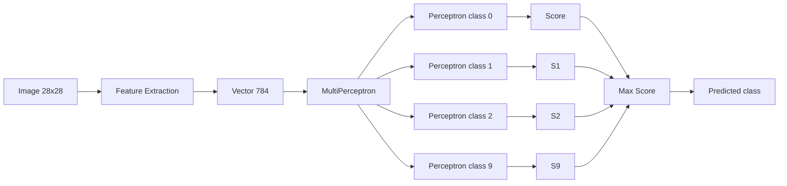

# Image Classification in Java (Perceptron, Logistic Regression, MLP, CNN)


Учебный проект по **классификации изображений на Java**.

Проект начался с реализации **MultiPerceptron** для задания **Princeton COS126 – Image Classification**, а затем был расширен более современными моделями:

- **MultiPerceptron**
- **Logistic Regression**
- **MLP (Multi-Layer Perceptron)**
- **CNN (Convolutional Neural Network)**

---

# 📌 Что реализовано

## Основной Java-проект (`src/`)
В основной части проекта реализованы:

- `Perceptron.java` — бинарный perceptron
- `MultiPerceptron.java` — многоклассовая классификация (One-vs-All)
- `LogisticRegression.java` — многоклассовая логистическая регрессия
- `MLP.java` — простая нейронная сеть
- `ImageClassifier.java` — единый pipeline для обучения и тестирования

Поддерживаемые режимы запуска:

- `perceptron`
- `logreg`
- `mlp`

## Отдельный CNN-проект (`cnn-java/`)
Для сверточной нейронной сети добавлен отдельный Maven-проект:

- `cnn-java/pom.xml`
- `cnn-java/src/main/java/CnnDigits.java`

CNN вынесена отдельно, потому что использует **Maven + DL4J**, а не ручную компиляцию через `javac -cp ...`.

---

# 🧠 Реализованные модели

| Model | Description |
|------|-------------|
| MultiPerceptron | линейная модель One-vs-All |
| Logistic Regression | вероятностная линейная модель |
| MLP | простая полносвязная нейронная сеть |
| CNN | сверточная нейронная сеть для изображений |

---

# 📁 Структура проекта

```text
PerceptronClassifier
│
├─ src
│   ├─ Perceptron.java
│   ├─ MultiPerceptron.java
│   ├─ LogisticRegression.java
│   ├─ MLP.java
│   └─ ImageClassifier.java
│
├─ lib
│   └─ stdlib.jar
│
├─ out
│   └─ compiled classes
│
├─ datasets
│   ├─ digits
│   │   ├─ digits.jar
│   │   ├─ training.zip
│   │   ├─ testing.zip
│   │   ├─ digits-training5.txt
│   │   ├─ digits-training10.txt
│   │   ├─ digits-training20.txt
│   │   ├─ digits-training30.txt
│   │   ├─ digits-training40.txt
│   │   ├─ digits-training50.txt
│   │   ├─ digits-training100.txt
│   │   ├─ digits-training6K.txt
│   │   ├─ digits-training60K.txt
│   │   ├─ digits-testing3.txt
│   │   ├─ digits-testing10.txt
│   │   ├─ digits-testing20.txt
│   │   ├─ digits-testing30.txt
│   │   ├─ digits-testing40.txt
│   │   ├─ digits-testing50.txt
│   │   ├─ digits-testing100.txt
│   │   ├─ digits-testing1K.txt
│   │   └─ digits-testing10K.txt
│   │
│   ├─ animals
│   ├─ fashion
│   ├─ Kuzushiji
│   ├─ music
│   └─ fruit
│
└─ cnn-java
   ├─ pom.xml
   └─ src
      └─ main
         └─ java
            └─ CnnDigits.java
````
---

# 🧠 Алгоритм

В основной части проекта используется **Multiclass Perceptron (One-vs-All)**.

Идея алгоритма:

1. Для каждого класса создаётся отдельный perceptron
2. Каждый perceptron обучается распознавать **свой класс**
3. При классификации выбирается perceptron с **максимальной оценкой**

Обучение выполняется по правилу обновления весов:

```
если prediction ≠ label:

weights[label] += x
weights[predicted] -= x
```

Где:

* `x` — вектор признаков изображения
* `label` — правильный класс
* `predicted` — предсказанный класс

Таким образом модель постепенно учится **различать классы изображений**.

---

# 🧠 Архитектура алгоритма



### Что происходит

1️⃣ изображение **28×28**
2️⃣ преобразуется в **784-мерный вектор признаков**
3️⃣ каждый perceptron обучается распознавать **один класс**
4️⃣ выбирается perceptron с **максимальной оценкой**

Это стратегия **One-vs-All**.

---

# 📄 Описание файлов в `src`

## `Perceptron.java`

Класс `Perceptron` реализует **бинарный perceptron**, который работает с двумя метками:

```
+1
-1
```

### Основные функции

* хранит массив весов
* вычисляет взвешенную сумму
* предсказывает класс
* обновляет веса при ошибке

Основные методы:

```
weightedSum()
predict()
train()
```

Если perceptron ошибается, веса обновляются:

```
weights[i] += label * x[i]
```

Этот класс является **базовым строительным блоком модели**.

---

## `MultiPerceptron.java`

Класс `MultiPerceptron` реализует **многоклассовую классификацию**.

Используется стратегия:

```
One-vs-All
```

То есть:

* для каждого класса создаётся отдельный perceptron
* каждый perceptron пытается распознать **свой класс**

При ошибке обновляются два perceptron:

```
perceptrons[predicted] -= x
perceptrons[label] += x
```

Основные методы:

```
predictMulti()
trainMulti()
numberOfClasses()
numberOfInputs()
```

---

## `LogisticRegression.java`

Этот класс реализует **многоклассовую логистическую регрессию**.

Особенности:

* используется функция **softmax**
* модель предсказывает **вероятности классов**
* веса обучаются методом **градиентного спуска**

Логистическая регрессия лучше perceptron, потому что:

* оптимизирует функцию потерь
* работает со **стохастическим градиентом**

---

## `MLP.java`

Класс `MLP` реализует **простую нейронную сеть**.

Структура сети:

```
Input layer (784)
Hidden layer
Output layer (10)
```

Используются:

* **ReLU** или **sigmoid** в скрытом слое
* **softmax** на выходе

Обучение происходит через:

```
backpropagation
```

---

## `ImageClassifier.java`

Это **главный класс проекта**.

Он объединяет:

* загрузку данных
* извлечение признаков
* обучение модели
* тестирование

### Что делает программа

1️⃣ читает training-файл
2️⃣ загружает изображения
3️⃣ извлекает признаки
4️⃣ обучает модель
5️⃣ тестирует модель
6️⃣ вычисляет `test error rate`

---

# 🔗 Связь между классами

Архитектура проекта выглядит так:

```
ImageClassifier
        │
        ▼
extractFeatures()
        │
        ▼
vector (784 features)
        │
        ▼
Model
 │      │       │
 ▼      ▼       ▼
Perceptron  LogisticRegression  MLP
        │
        ▼
prediction
```

### Логика работы

1️⃣ `ImageClassifier` читает изображение
2️⃣ преобразует его в **вектор признаков**
3️⃣ передаёт его выбранной модели

Модель:

* вычисляет оценки классов
* выбирает **максимальную**

После тестирования программа выводит:

```
test error rate
```
---

# 🖼 Как представляются изображения

В основном проекте изображение преобразуется в одномерный вектор признаков длины:

```text
width * height
```

Для изображения `28×28` это:

```text
784 признака
```

В `ImageClassifier.java` используется яркость пикселя, нормализованная в диапазон `[0, 1]`.

---

# 📂 Формат данных для digits

Для датасета `digits` в проекте используются **два способа хранения изображений**.

## 1. Полные наборы через `digits.jar`

Файлы:

* `digits-training6K.txt`
* `digits-training60K.txt`
* `digits-testing1K.txt`
* `digits-testing10K.txt`

используют пути вида:

```text
jar:file:digits.jar!/training/7/4545.png   7
jar:file:digits.jar!/training/5/49785.png  5
```

Это означает, что изображения читаются **напрямую из архива**:

```text
datasets/digits/digits.jar
```

Для таких запусков **распаковка не нужна**.

---

## 2. Маленькие тесты и CNN через распакованные PNG

Файлы вроде:

* `digits-training5.txt`
* `digits-training10.txt`
* `digits-training20.txt`
* `digits-training30.txt`
* `digits-training40.txt`
* `digits-training50.txt`
* `digits-training100.txt`
* `digits-testing3.txt`
* `digits-testing10.txt`
* `digits-testing20.txt`
* `digits-testing30.txt`
* `digits-testing40.txt`
* `digits-testing50.txt`
* `digits-testing100.txt`

используют обычные относительные пути вида:

```text
digits/training/1/99.png 1
digits/training/9/19.png 9
digits/training/0/69.png 0
```

Для таких файлов нужна **распакованная папка с PNG**.

---

# 📦 Почему `training.zip` и `testing.zip` важны

Файлы:

* `datasets/digits/training.zip`
* `datasets/digits/testing.zip`

содержат **распаковываемые PNG-изображения**, которые нужны:

* для маленьких тестовых запусков
* для локального просмотра изображений
* для **CNN**, если сеть читает изображения из папок `training/0..9` и `testing/0..9`

То есть:

* для `digits.jar` распаковка не нужна
* для **CNN распаковка нужна**

---

# ✅ Как правильно распаковать ZIP для CNN

Нужно распаковать оба архива:

* `training.zip`
* `testing.zip`

в папку:

```text
datasets/digits/
```

После правильной распаковки структура должна получиться такой:

```text
datasets/digits
│
├─ digits.jar
├─ training.zip
├─ testing.zip
│
├─ training/
│   ├─ 0/
│   ├─ 1/
│   ├─ 2/
│   ├─ 3/
│   ├─ 4/
│   ├─ 5/
│   ├─ 6/
│   ├─ 7/
│   ├─ 8/
│   └─ 9/
│
└─ testing/
    ├─ 0/
    ├─ 1/
    ├─ 2/
    ├─ 3/
    ├─ 4/
    ├─ 5/
    ├─ 6/
    ├─ 7/
    ├─ 8/
    └─ 9/
```

## Windows PowerShell

Из папки `datasets/digits`:

```powershell
Expand-Archive training.zip
Expand-Archive testing.zip
```

## Linux / macOS

```bash
unzip training.zip
unzip testing.zip
```

---

⚠️ Важно: для CNN папки должны называться именно так

Для `CnnDigits.java` ожидается структура:

```text
training/
  0/
  1/
  ...
  9/

testing/
  0/
  1/
  ...
  9/
```

Если после распаковки архив создаёт лишнюю вложенную папку, например:

```text
datasets/digits/digits/training
datasets/digits/digits/testing
```

то путь в `CnnDigits.java` нужно либо:

* исправить,
* либо переместить папки на уровень выше.

---

# 🧪 Реальные размеры набора для CNN

В локальном запуске CNN использовалось:

* `training`: **60000 images**
* `testing`: **10062 images**

Команды подсчёта на Windows:

```cmd
dir /s /b "C:\ … your files … \*.png" | find /c /v ""
dir /s /b "C:\ … your files … \digits\testing\*.png" | find /c /v ""
```

Принцип работы:

* `dir /s /b` выводит все `.png` файлы по одному пути на строку
* `find /c /v ""` считает количество непустых строк
* одна строка = один файл

---

# 📊 Результаты на датасете digits

| Model               | Test Error Rate |   Accuracy |
| ------------------- | --------------: | ---------: |
| MultiPerceptron     |          0.1293 |     87.07% |
| Logistic Regression |          0.1039 |     89.61% |
| MLP                 |          0.0313 |     96.87% |
| CNN                 |      **0.0167** | **98.33%** |

## Как считалась accuracy

```text
accuracy = 1 - error_rate
```

Пример:

```text
1 - 0.0167 = 0.9833 = 98.33%
```

---

# 📈 Интерпретация результатов

Эксперименты на `digits` показывают, что качество модели растёт по мере усложнения архитектуры:

```text
MultiPerceptron → Logistic Regression → MLP → CNN
```

Причина:

* **Perceptron** и **Logistic Regression** — более простые модели
* **MLP** умеет находить нелинейные зависимости
* **CNN** лучше всего подходит для изображений, потому что учитывает пространственную структуру, локальные признаки, контуры и формы

---

# 🧪 Результаты базовой perceptron-модели на других датасетах

| Dataset   | Training Size | Test Size | Error Rate |
| --------- | ------------: | --------: | ---------: |
| digits    |        60 000 |    10 000 | **0.1293** |
| fashion   |        60 000 |    10 000 |     0.2204 |
| Kuzushiji |        60 000 |    10 000 |     0.4587 |
| animals   |        60 000 |    12 000 |     0.7328 |
| music     |        50 000 |    10 000 |     0.5479 |
| fruit     |        30 000 |     6 000 | **0.1361** |

---

# ⚙️ Компиляция основного проекта

Из корня проекта:

```cmd
javac -cp ".;lib\stdlib.jar" -d out src\*.java
```

---

# 🚀 Запуск основного проекта

Перейти в папку датасета:

```cmd
cd /d "C:\ … your files …  \datasets\digits"
```

## MultiPerceptron

```cmd
java -cp "..\..\out;..\..\lib\stdlib.jar" ImageClassifier digits-training60K.txt digits-testing10K.txt
```

или явно:

```cmd
java -cp "..\..\out;..\..\lib\stdlib.jar" ImageClassifier digits-training60K.txt digits-testing10K.txt perceptron
```

## Logistic Regression

```cmd
java -cp "..\..\out;..\..\lib\stdlib.jar" ImageClassifier digits-training60K.txt digits-testing10K.txt logreg
```

## MLP

```cmd
java -cp "..\..\out;..\..\lib\stdlib.jar" ImageClassifier digits-training60K.txt digits-testing10K.txt mlp
```

---

# 🧠 CNN: отдельный Maven-проект

CNN находится в папке:

```text
cnn-java/
```

Используемый стек:

* Maven
* Deeplearning4j
* ND4J
* DataVec

---

# 📁 Структура CNN-проекта

```text
cnn-java
├─ pom.xml
└─ src
   └─ main
      └─ java
         └─ CnnDigits.java
```

---

# 🛠 Как подготовить папку `cnn-java`

Из корня проекта:

```cmd
cd /d "C: … your files …  \PerceptronClassifier"
mkdir cnn-java
mkdir cnn-java\src
mkdir cnn-java\src\main
mkdir cnn-java\src\main\java
```

После этого нужно создать файлы:

* `cnn-java\pom.xml`
* `cnn-java\src\main\java\CnnDigits.java`

---

# 📦 Как установить Maven

## 1. Скачать Maven

Официальный сайт:

```text
https://maven.apache.org/download.cgi
```

Нужно скачать **Binary zip archive**, например:

```text
apache-maven-3.9.13-bin.zip
```

## 2. Распаковать

Например сюда:

```text
D:\Tools\apache-maven-3.9.13
```

Важно, чтобы существовал файл:

```text
D:\Tools\apache-maven-3.9.13\bin\mvn.cmd
```

## 3. Проверить Maven

```cmd
"D:\Tools\apache-maven-3.9.13\bin\mvn.cmd" -v
```

Пример:

```text
Apache Maven 3.9.13
Java version: 21
```

---

# ▶️ Запуск CNN

Из папки `cnn-java`:

```cmd
cd /d "C:\ … your files …  \PerceptronClassifier\cnn-java"
"C:\Tools\apache-maven-3.9.13\bin\mvn.cmd" compile
"C:\Tools\apache-maven-3.9.13\bin\mvn.cmd" exec:java
```

## Что делает Maven

### `compile`

Команда:

```cmd
"D:\Tools\apache-maven-3.9.13\bin\mvn.cmd" compile
```

делает следующее:

* читает `pom.xml`
* скачивает нужные библиотеки
* компилирует `src\main\java\CnnDigits.java`

### `exec:java`

Команда:

```cmd
"D:\Tools\apache-maven-3.9.13\bin\mvn.cmd" exec:java
```

делает следующее:

* запускает главный Java-класс, указанный в `pom.xml`
* обучает CNN
* выводит метрики качества

---

# ✅ Итоговые результаты CNN на digits

После 2 эпох CNN показала:

* **Accuracy:** 98.33%
* **Test Error Rate:** 0.0167

---

# 📚 Используемые датасеты

| Dataset   | Source           |
| --------- | ---------------- |
| digits    | MNIST            |
| fashion   | Fashion-MNIST    |
| Kuzushiji | Kuzushiji-MNIST  |
| animals   | Google QuickDraw |
| music     | Google QuickDraw |
| fruit     | Google QuickDraw |

---

# 👨‍💻 Автор

**Amanzhol**

Учебный проект по Java и Machine Learning.

Реализованы:

* Perceptron
* Logistic Regression
* MLP
* CNN

````
# ⭐ Если проект оказался полезным

Если этот проект оказался полезным или интересным,
можно поставить ⭐ репозиторию на GitHub.
